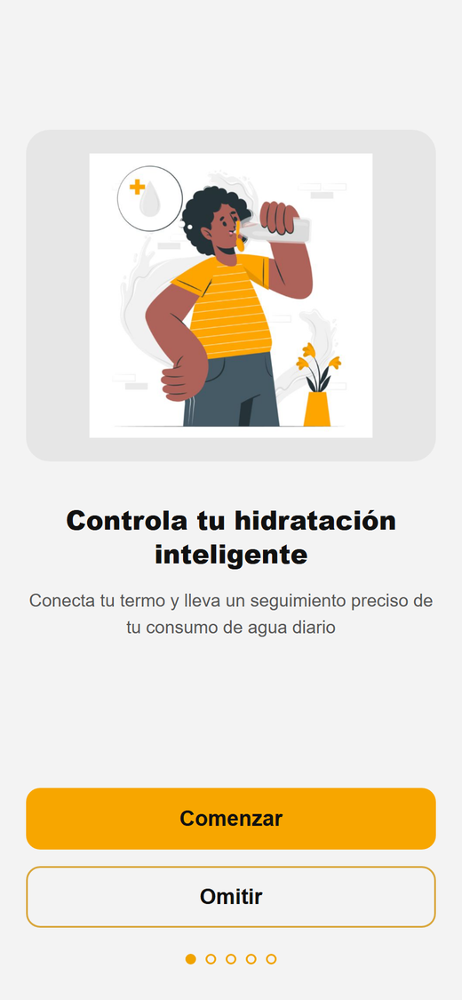
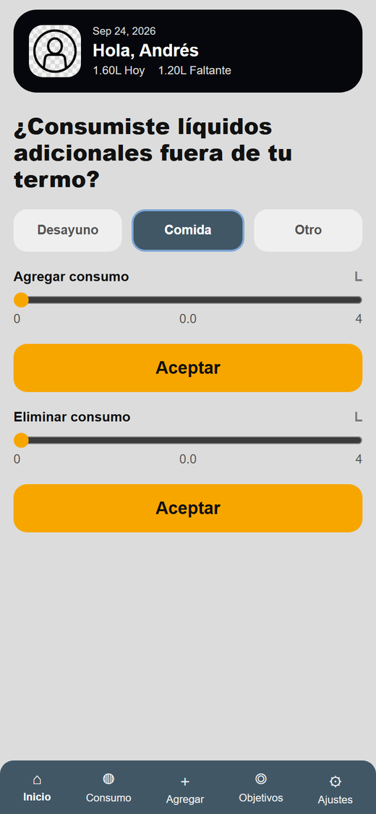
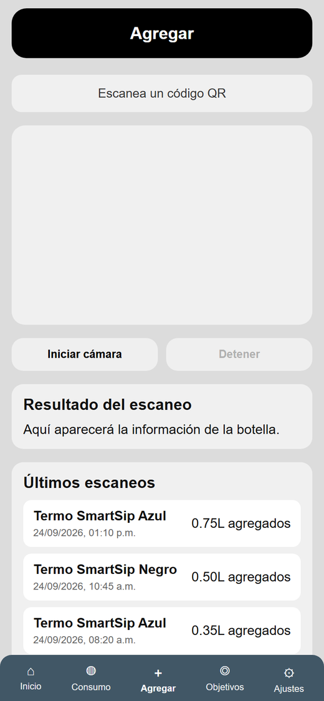
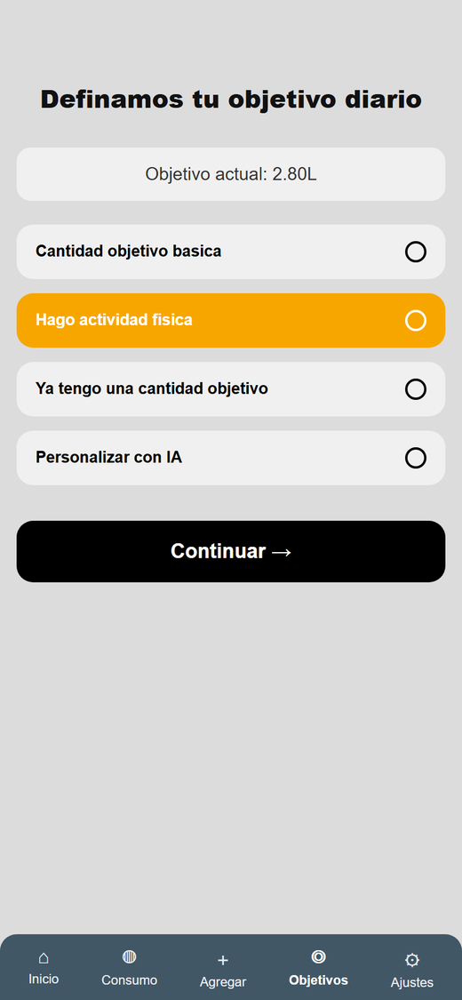
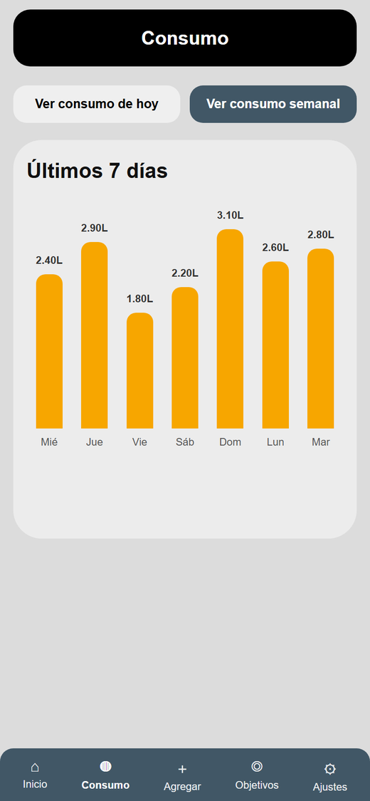
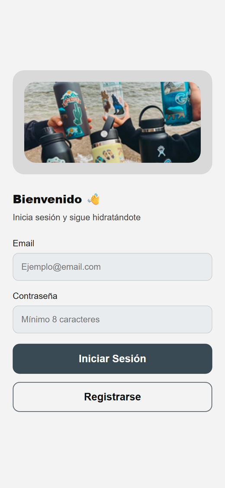
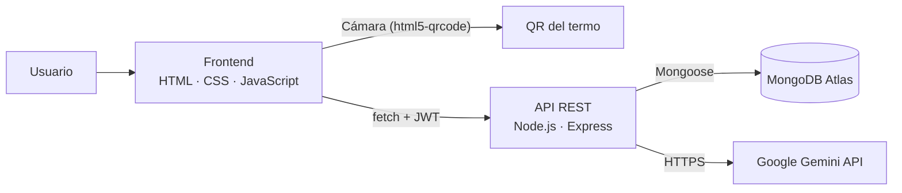

<div align="center">

# SmartSip

**Aplicación web full-stack para controlar la hidratación diaria:** escanea el código QR de tu termo, registra lo que tomas y define tu meta de agua con ayuda de inteligencia artificial.


</div>

<table>
  <tr>
    <td align="center"><br><sub>Bienvenida</sub></td>
    <td align="center"><br><sub>Inicio</sub></td>
    <td align="center"><br><sub>Escaneo QR del termo</sub></td>
  </tr>
  <tr>
    <td align="center"><br><sub>Meta diaria (incluye IA)</sub></td>
    <td align="center"><br><sub>Consumo semanal</sub></td>
    <td align="center"><br><sub>Inicio de sesión</sub></td>
  </tr>
</table>

<sub>Capturas tomadas con datos de demostración.</sub>

## Sobre el proyecto

Mucha gente no sabe cuánta agua debería tomar ni cuánta toma realmente. **SmartSip** resuelve ambas cosas: calcula una meta diaria personalizada y lleva el registro del consumo de forma casi automática, leyendo el código QR de un "termo inteligente" que reporta cuánta agua se ha bebido. Lo que se toma fuera del termo (en el desayuno, la comida, etc.) se puede agregar manualmente.

La app está diseñada con una interfaz tipo móvil y cuenta con backend propio, base de datos en la nube y un asistente conversacional con IA.

## Funcionalidades

- **Cuentas de usuario** con registro, inicio de sesión y sesiones protegidas por JWT.
- **Meta diaria de agua**, calculada de cuatro formas:
  - **Básica:** según el peso (35 ml por kg).
  - **Con actividad física:** agrega 0.25 L, 0.5 L o 0.75 L según los minutos de ejercicio al día.
  - **Manual:** el usuario escribe su propia meta, en litros o mililitros.
  - **Con IA:** un chat con **SmartSip IA** (Google Gemini) hace preguntas sobre peso, rutina, clima y hábitos, y recomienda una meta entre 1 y 6 L.
- **Escaneo del termo por QR** con la cámara del dispositivo; el agua consumida se suma automáticamente y se guarda un historial de escaneos.
- **Registro manual** para agregar o corregir el consumo del día.
- **Seguimiento:** avance del día respecto a la meta y gráfica de los últimos 7 días.
- **Perfil y ajustes:** edición de datos personales, foto de perfil y modo oscuro.

## Aspectos técnicos destacados

- **API REST de 20 endpoints** con Express 5, organizada por dominio: autenticación, usuarios, consumo, metas, IA y botellas.
- **Seguridad:** contraseñas cifradas con `bcrypt`, tokens JWT con expiración de 7 días, validación de datos en el servidor y credenciales fuera del código mediante variables de entorno.
- **Integración con un LLM:** la IA recibe instrucciones de sistema y responde en **JSON estructurado** (`reply`, `recommendedGoalLiters`, `readyToFinalize`). El servidor valida la respuesta, limita la meta a un rango seguro y, si el modelo no devuelve JSON válido, extrae la cantidad del texto.
- **Lectura de QR flexible:** el QR puede traer los datos de la botella en JSON o una URL que los devuelva (con soporte de redirecciones), y acepta nombres de campo en inglés o en español.
- **Modelado de datos con Mongoose:** usuarios, consumo diario (con índice único por usuario y fecha, y el detalle de cada acción) y escaneos de botellas.

## Arquitectura



## Tecnologías

| Capa | Tecnologías |
|---|---|
| Frontend | HTML5, CSS3, JavaScript (vanilla), [html5-qrcode](https://github.com/mebjas/html5-qrcode) |
| Backend | Node.js, Express 5 |
| Base de datos | MongoDB Atlas, Mongoose |
| Autenticación | JSON Web Tokens, bcrypt |
| Inteligencia artificial | Google Gemini API (`gemini-2.5-flash-lite`) |

## Estructura del proyecto

```
smartsip/
├── server.js          # Servidor Express y API REST
├── models/            # Esquemas de Mongoose (User, DailyConsumption, BottleScan)
├── Frontend/          # Pantallas de la app (HTML, CSS, JS e imágenes)
├── docs/
│   ├── screenshots/   # Capturas para este README
│   └── qr-ejemplos/   # Códigos QR de prueba
├── .env.example       # Plantilla de variables de entorno
└── package.json
```

## Cómo ejecutarlo

**Requisitos:** [Node.js](https://nodejs.org/) 20.19 o superior y una base de datos de MongoDB (por ejemplo, un clúster gratuito de [MongoDB Atlas](https://www.mongodb.com/atlas)).

```bash
git clone https://github.com/AndressOlvera/smartsip.git
cd smartsip
npm install
cp .env.example .env   # en Windows: copy .env.example .env
```

Completa el archivo `.env`:

| Variable | Descripción |
|---|---|
| `MONGODB_URI` | Cadena de conexión de MongoDB |
| `JWT_SECRET` | Clave para firmar los tokens de sesión |
| `GEMINI_API_KEY` | API key de [Google AI Studio](https://aistudio.google.com/) (opcional, solo para la función de IA) |
| `PORT` | Puerto del servidor (por defecto `3000`) |

Inicia la app y abre <http://localhost:3000>:

```bash
npm start      # o "npm run dev" para reiniciar automáticamente al editar
```

> Para usar la cámara, entra desde `localhost` y acepta el permiso del navegador.

### Probar el escáner QR

En [`docs/qr-ejemplos`](docs/qr-ejemplos) hay códigos QR de prueba. Un QR válido contiene un JSON como este, o una URL que lo devuelva:

```json
{
  "bottleName": "Termo SmartSip",
  "totalCapacityLiters": 1,
  "consumedLiters": 0.5,
  "color": "Azul",
  "material": "Acero inoxidable"
}
```

<details>
<summary><strong>Referencia de la API</strong></summary>

<br>

Todas las rutas, excepto registro e inicio de sesión, requieren el encabezado `Authorization` con el token JWT.

| Método | Ruta | Descripción |
|---|---|---|
| POST | `/api/auth/register` | Crear cuenta |
| POST | `/api/auth/login` | Iniciar sesión y obtener token |
| POST | `/api/auth/logout` | Cerrar sesión |
| GET | `/api/users/me` | Datos del usuario |
| PATCH | `/api/users/me` | Actualizar nombre, correo o contraseña |
| PATCH | `/api/users/dark-mode` | Activar o desactivar modo oscuro |
| PATCH | `/api/users/profile-image` | Cambiar foto de perfil |
| GET | `/api/home/summary` | Resumen del día para la pantalla de inicio |
| POST | `/api/consumption/add` | Agregar consumo manual |
| POST | `/api/consumption/remove` | Quitar consumo |
| GET | `/api/consumption/today` | Consumo de hoy vs. meta |
| GET | `/api/consumption/weekly` | Consumo de los últimos 7 días |
| GET | `/api/goals/current` | Meta actual |
| POST | `/api/goals/basic` | Calcular meta básica |
| POST | `/api/goals/activity` | Calcular meta con actividad física |
| POST | `/api/goals/manual` | Guardar meta manual |
| POST | `/api/goals/ai/chat` | Conversar con SmartSip IA |
| POST | `/api/goals/ai/finalize` | Guardar la meta acordada con la IA |
| POST | `/api/bottles/scan` | Registrar el escaneo del QR de una botella |
| GET | `/api/bottles/scans` | Últimos 10 escaneos |

</details>

## Autor

**Andrés Alfonso Olvera Gonzalez** · [GitHub @AndressOlvera](https://github.com/AndressOlvera)
